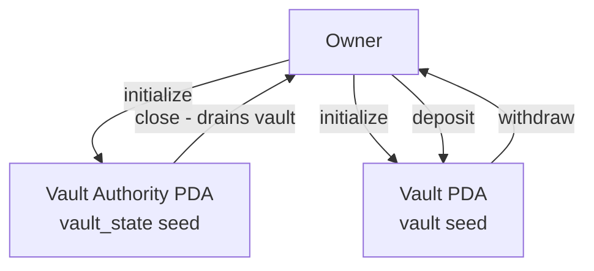

# Vault

A Solana program that lets you lock SOL away in your own personal vault — and take it back whenever you want.

Built with Anchor as part of a Solana dev cohort.

## What it does

You create a vault that only you control. You can put SOL in, take SOL out, and close it when you're done. That's it.

Under the hood, two accounts get created for you (both PDAs derived from your wallet):

- **Vault** — the account that actually holds your SOL
- **Vault Authority** — keeps track of who owns the vault and any withdrawal limits you set



## Instructions

**`initialize`** — Sets up your vault. You can optionally pass a `max_withdraw` amount to cap how much can be taken out in a single transaction.

**`deposit`** — Sends SOL from your wallet into the vault. The program makes sure you always keep enough to stay rent-exempt.

**`withdraw`** — Pulls SOL back from the vault to your wallet. If you set a `max_withdraw` limit, it's enforced here.

**`close`** — Drains everything from the vault back to you and closes both accounts, so you get the rent back too.

## Program ID

```
FyDvvhk88TLkkYAKNkE2YhrV6g8XDyJVcggWXKLe7jta
```

## Getting started

You'll need Rust, the Solana CLI, and Anchor installed. Then:

```bash
# build the program
anchor build

# run the tests
cargo test
```

## Tests

Tests use [LiteSVM](https://github.com/LiteSVM/litesvm), which simulates transactions in-process — no local validator needed, so they run fast.

| File                 | What it checks                                                                          |
| -------------------- | --------------------------------------------------------------------------------------- |
| `test_initialize.rs` | Vault gets created with the right state and seeded with rent                            |
| `test_deposit.rs`    | SOL lands in the vault and the balance adds up correctly                                |
| `challenge.rs`       | Full end-to-end flow — initialize, deposit, withdraw (valid and over-limit), then close |

Common setup (loading the program, creating a payer, airdropping SOL) lives in `tests/utils/mod.rs` and is shared across all test files.
